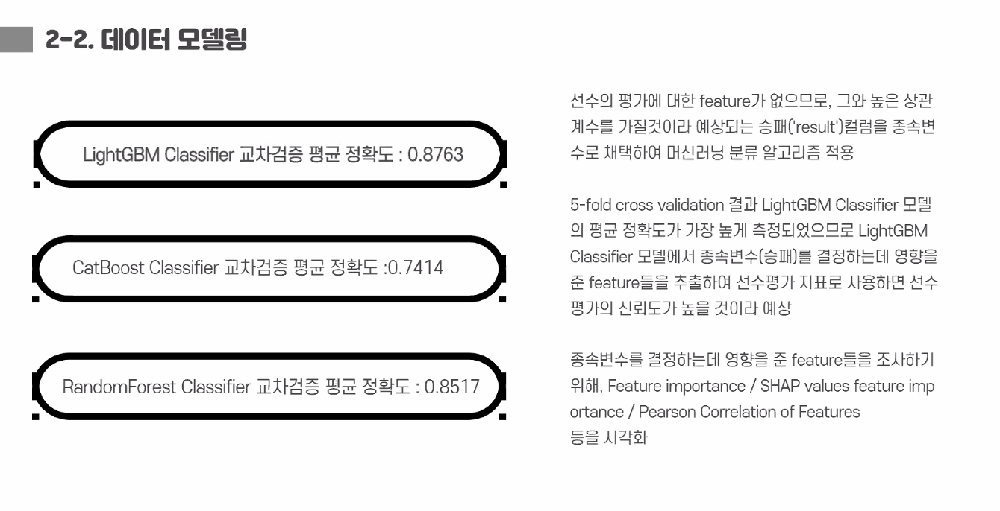

<p align="center">
  
</p>

<h1 align="center">Data Analysis Archive</h1>

<p align="center">OP.GG 기반 이스포츠 데이터 분석 교육 과정과 팀 프로젝트의 원본 실습 아카이브</p>

<p align="center">Python · Jupyter Notebook · pandas · SQL · 머신러닝</p>

> League of Legends 경기·챔피언 데이터를 수집하고, 승패·티어·포지션·픽률을 분석한 교육 과정 산출물을 보존한 저장소입니다.

---

## 저장소 소개

이 저장소는 부산 이스포츠 데이터 분석 교육 과정에서 작성한 수집·전처리·시각화·모델링 노트북을 원형에 가깝게 보존합니다. 최종 포트폴리오용으로 정리된 버전은 [`busan-esports-data-analysis`](https://github.com/scnelMG/busan-esports-data-analysis) 저장소에서 확인할 수 있습니다.

## 분석 주제

- OP.GG 경기·챔피언 통계 수집
- 티어·포지션별 승률과 픽률 분석
- 챔피언·선수 지표 시각화
- 경기 feature 기반 승패 예측 모델 실험
- 데이터 정합성 확인과 결과 해석

## 폴더 안내

```text
OP.GG_데이터분석과정/
└── busan_esports_project/
    ├── 데이터 수집·전처리 노트북
    ├── 챔피언·티어·포지션 분석 노트북
    ├── 모델링 실험
    └── 발표 자료와 결과 이미지
```

## 대표 결과물

실제 팀 발표 자료와 분석 결과 캡처는 `OP.GG_데이터분석과정/busan_esports_project/`에 보관되어 있습니다. 이 저장소는 학습·실험 아카이브이므로, 정제된 문제 정의·모델 결과·재현 가이드는 포트폴리오 저장소를 우선 참고합니다.

## 실행 방법

```bash
python -m venv .venv
# Windows: .venv\Scripts\activate
pip install jupyter pandas numpy matplotlib seaborn scikit-learn
jupyter notebook
```

일부 노트북은 수집 시점의 원본 데이터, API 접근 정보, 로컬 파일 경로에 의존하므로 전체 재실행이 보장되지 않습니다.

## 이용 안내

이 저장소는 포트폴리오·학습 기록 열람을 위해 공개합니다. 코드·문서·이미지의 재사용, 수정, 배포는 사전 문의가 필요합니다.
